# GM Smart Shield — Technical Documentation

> **Version:** 0.1.0 — Pre-Alpha  
> **Last Updated:** 2026-02-24  
> **Status:** Architecture Design

---

## 1. System Overview

GM Smart Shield is a **locally-hosted full-stack web application** composed of:

- A **React-based Web Frontend** served locally
- A **Python FastAPI backend** providing REST APIs and background task orchestration
- A **multi-agent LLM layer** powered by locally-running models via Ollama
- A **ChromaDB vector database** for semantic search over knowledge sources
- A **SQLite database** for structured data (notes, sheets, metadata)

All components run entirely on the GM's local machine — no external cloud services are required for core functionality.

---

## 2. High-Level Architecture

```mermaid
graph TB
    subgraph Browser["🌐 Browser (Web App)"]
        UI[React Frontend]
    end

    subgraph API["🐍 Python FastAPI Backend"]
        REST[REST API Layer]
        TaskQueue[Background Task Queue\nCelery / ARQ]
        AgentOrchestrator[Agent Orchestrator]
    end

    subgraph Agents["🤖 LLM Agents"]
        QueryAgent[Query Agent\nllama3.2:3b]
        SheetAgent[Sheet Agent\nllama3.2:3b]
        RefAgent[Reference Agent\nllama3.2:3b]
        EncounterAgent[Encounter Agent\ngemma3:12b-it-qat]
        TagAgent[Tagging Agent\nllama3.2:3b]
    end

    subgraph LLMRuntime["⚙️ LLM Runtime"]
        Ollama[Ollama / llama.cpp\nLocal Model Server]
    end

    subgraph Storage["💾 Local Storage"]
        ChromaDB[(ChromaDB\nVector Store)]
        SQLite[(SQLite\nStructured Data)]
        FileSystem[File System\nPDFs & Markdown]
    end

    UI -->|HTTP / REST| REST
    REST --> AgentOrchestrator
    REST --> TaskQueue
    AgentOrchestrator --> QueryAgent
    AgentOrchestrator --> SheetAgent
    AgentOrchestrator --> RefAgent
    AgentOrchestrator --> EncounterAgent
    AgentOrchestrator --> TagAgent
    QueryAgent --> Ollama
    SheetAgent --> Ollama
    RefAgent --> Ollama
    EncounterAgent --> Ollama
    TagAgent --> Ollama
    TaskQueue --> AgentOrchestrator
    AgentOrchestrator --> ChromaDB
    AgentOrchestrator --> SQLite
    REST --> ChromaDB
    REST --> SQLite
    REST --> FileSystem
```



---

## 3. Technology Stack

### 3.1 Frontend

| Layer | Technology | Rationale |
|---|---|---|
| Framework | **React + Vite** | Fast HMR, modern tooling |
| Language | **TypeScript** | Type safety |
| Styling | **Tailwind CSS + shadcn/ui** | Rapid, consistent UI development |
| State Management | **Zustand** | Lightweight, minimal boilerplate |
| Markdown Editor | **CodeMirror 6** | Powerful, extensible |
| Markdown Preview | **remark / rehype** | GFM + frontmatter support |
| HTTP Client | **TanStack Query + axios** | Caching, loading states |
| Testing | **Vitest + Playwright-BDD** | Unit & E2E/BDD testing |

### 3.2 Backend

| Layer | Technology | Rationale |
|---|---|---|
| Framework | **FastAPI** | Async, auto-docs, Pythonic |
| Language | **Python 3.12+** | Ecosystem for AI/ML |
| Async Tasks | **ARQ** (or Celery + Redis) | Background document processing |
| Vector DB | **ChromaDB** | Local, embeddable, Python-native |
| Structured DB | **SQLite** | File-based, zero-config |
| ORM | **SQLAlchemy 2.x + Alembic** | Migrations, async support |
| PDF Parsing | **PyMuPDF (fitz)** | Fast, accurate PDF extraction |
| Markdown Parsing | **python-frontmatter + mistune** | Frontmatter-aware parsing |
| Embeddings | **sentence-transformers** | Local embedding models |
| Agent Framework | **LangChain / LlamaIndex** | RAG pipelines and agent logic |

### 3.3 LLM Runtime

| Model | Use Case | Speed Profile |
|---|---|---|
| `llama3.2:3b` | Q&A, tagging, sheet extraction | ⚡ Fast (~1–2s) |
| `granite4:latest` | Structured generation, references | ⚡ Fast |
| `gemma3:12b-it-qat` | Encounter generation, creative tasks | 🐢 Slower (~5–15s) |

All models are served via **Ollama** (default) or **llama.cpp** as a drop-in alternative.

---

## 4. Document Ingestion Pipeline

```mermaid
flowchart LR
    Upload[GM Uploads\nPDF / MD / TXT] --> Parser

    subgraph Ingestion["Document Ingestion Pipeline"]
        Parser[Document Parser\nPyMuPDF / python-frontmatter] --> Chunker
        Chunker[Text Chunker\nRecursive / Semantic] --> Embedder
        Embedder[Embedding Generator\nsentence-transformers\nall-MiniLM-L6-v2] --> VectorStore
        VectorStore[(ChromaDB\nVector Store)]
        Parser --> MetaStore
        MetaStore[(SQLite\ndocument metadata)]
    end

    VectorStore --> BackgroundPipeline

    subgraph BackgroundPipeline["🔄 Background Task Pipeline (on upload)"]
        direction TB
        T1[Task 1: Extract Character\nSheet Template]
        T2[Task 2: Generate Quick\nReferences]
        T3[Task 3: Build Knowledge\nGraph Links]
        T1 --> T2 --> T3
    end
```



### Pipeline Steps

1. **Upload** — GM uploads file via the web UI
2. **Parse** — Extract raw text and structure (chapters, sections, page numbers)
3. **Chunk** — Split into semantic units (~512 tokens with overlap)
4. **Embed** — Generate vector embeddings using a local `sentence-transformers` model
5. **Store** — Save vectors to ChromaDB; save document metadata to SQLite
6. **Background tasks** — Trigger asynchronous agents for sheet template extraction, quick references, and knowledge graph linking

---

## 5. Agent Architecture


### 5.1 Query Agent

- **Trigger:** User submits a question through the chat interface
- **Process:** Retrieve top-K semantically similar chunks from ChromaDB → pass to LLM with RAG prompt → return answer with source citations (document name + page number)
- **Model:** `llama3.2:3b` or `granite4:latest`

### 5.2 Sheet Agent

- **Trigger:** Document upload complete (background task)
- **Process:** Identify character sheet sections in document → extract fields → generate Markdown + frontmatter template → save to SQLite
- **Model:** `llama3.2:3b`

### 5.3 Reference Agent

- **Trigger:** Document upload complete (background task)
- **Process:** Identify reference categories (spells, classes, races, items, etc.) → generate structured quick reference cards per category → save as Markdown files
- **Model:** `llama3.2:3b`

### 5.4 Encounter Agent

- **Trigger:** GM requests encounter generation (interactive)
- **Process:** Accept parameters (party level, environment, tone) → retrieve relevant monsters/NPCs from knowledge base → generate encounter narrative + NPC stat blocks in Markdown
- **Model:** `gemma3:12b-it-qat` (for creative quality)

### 5.5 Tagging Agent

- **Trigger:** GM saves a note
- **Process:** Analyze note content → extract keywords and named entities → match against knowledge sources → create bidirectional links with page references → save tags to SQLite
- **Model:** `llama3.2:3b`

---

## 6. Data Models

### 6.1 SQLite Schema (Prisma / SQLAlchemy)


### 6.2 ChromaDB Collections

| Collection | Content | Metadata |
|---|---|---|
| `knowledge_chunks` | Document text chunks | `source_id`, `page`, `chunk_index`, `filename` |
| `note_embeddings` | Note content vectors | `note_id`, `title`, `tags` |
| `reference_cards` | Quick reference content | `category`, `source_id` |

### 6.3 Markdown Frontmatter Schemas

**Note frontmatter:**
```yaml
---
title: "Session 12 — The Dragon's Lair"
tags: [dragon, lore, session-notes]
session: 12
date: 2026-02-24
location: The Ember Mountains
npcs: [Zarathon the Red, Brother Aldric]
sources:
  - file: "monster-manual.pdf"
    page: 87
---
```

**Character Sheet frontmatter:**
```yaml
---
type: character-sheet
system: D&D 5e
player: "Alice"
character: "Elara Nightwhisper"
class: Ranger
level: 7
race: Wood Elf
background: Outlander
alignment: Neutral Good
---
```

**NPC / Encounter frontmatter:**
```yaml
---
type: npc
name: "Zarathon the Red"
cr: 17
size: Huge
type: Dragon
alignment: Chaotic Evil
hp: 256
ac: 19
source: "Monster Manual"
page: 96
---
```

---

## 7. API Design

### 7.1 Endpoint Groups

| Prefix | Resource | Description |
|---|---|---|
| `/api/knowledge` | Knowledge Sources | Upload, list, delete documents |
| `/api/chat` | Query Agent | Submit questions, get answers |
| `/api/notes` | Notes | CRUD for GM notes |
| `/api/references` | Quick References | List, fetch quick reference cards |
| `/api/sheets` | Character Sheets | Templates and player sheets |
| `/api/encounters` | Encounter Generator | Generate and save encounters |
| `/api/tasks` | Background Tasks | Task status polling |

### 7.2 Key Endpoints

```
POST   /api/knowledge/upload          Upload a PDF, MD, or TXT file
GET    /api/knowledge                 List all knowledge sources
DELETE /api/knowledge/{id}            Remove a knowledge source
GET    /api/knowledge/{id}/status     Check processing status

POST   /api/chat/query                Submit a question (RAG Q&A)

GET    /api/notes                     List all notes
POST   /api/notes                     Create a note
GET    /api/notes/{id}                Get a note
PUT    /api/notes/{id}                Update a note (triggers auto-tagging)
DELETE /api/notes/{id}                Delete a note

GET    /api/references                List all quick references
GET    /api/references?category=spell Filter by category

GET    /api/sheets/templates          List character sheet templates
POST   /api/sheets                    Create a player character sheet
GET    /api/sheets/{id}               Get a player sheet
PUT    /api/sheets/{id}               Update a player sheet

POST   /api/encounters/generate       Generate a new encounter
GET    /api/encounters                List saved encounters
GET    /api/encounters/{id}           Get an encounter

GET    /api/tasks/{taskId}            Poll background task status
```

---

## 8. Background Task Flow

```mermaid
sequenceDiagram
    participant GM as 🎲 GM
    participant API as FastAPI
    participant Queue as Task Queue (ARQ)
    participant SheetAgent as Sheet Agent
    participant RefAgent as Reference Agent
    participant TagAgent as Tagging Agent
    participant Chroma as ChromaDB
    participant DB as SQLite

    GM->>API: POST /api/knowledge/upload (file)
    API->>DB: Save KnowledgeSource (status=processing)
    API->>Queue: Enqueue ingestion task
    API-->>GM: 202 Accepted { taskId }

    Queue->>API: Run ingestion
    API->>Chroma: Store chunks + embeddings
    API->>DB: Update status=embedded

    Queue->>SheetAgent: Extract character sheet template
    SheetAgent->>Chroma: Query document structure
    SheetAgent->>DB: Save CharacterSheetTemplate

    Queue->>RefAgent: Generate quick references
    RefAgent->>Chroma: Query spell/class/race sections
    RefAgent->>DB: Save QuickReference records
    DB->>DB: Update status=complete

    GM->>API: GET /api/tasks/{taskId}
    API-->>GM: { status: complete }
```



---

## 9. Note Auto-Tagging Flow

```mermaid
sequenceDiagram
    participant GM as 🎲 GM
    participant API as FastAPI
    participant TagAgent as Tagging Agent
    participant Chroma as ChromaDB
    participant DB as SQLite

    GM->>API: PUT /api/notes/{id} (content)
    API->>DB: Save note content
    API->>Queue: Enqueue tagging task
    API-->>GM: 200 OK

    Queue->>TagAgent: Process note content
    TagAgent->>TagAgent: Extract keywords + entities via LLM
    TagAgent->>Chroma: Semantic search: keywords → knowledge chunks
    Chroma-->>TagAgent: Matching chunks (source_id, page)
    TagAgent->>DB: Save NoteTag records (tag, source_id, page)
    TagAgent->>DB: Update Note frontmatter with tags
```



---

## 10. Folder Structure

```
gm-smart-shield/
├── apps/
│   ├── web/                        # React frontend (Vite + TypeScript)
│   │   ├── src/
│   │   │   ├── components/
│   │   │   │   ├── chat/           # Q&A chat interface
│   │   │   │   ├── editor/         # Markdown note editor
│   │   │   │   ├── knowledge/      # Knowledge source management
│   │   │   │   ├── sheets/         # Character sheet UI
│   │   │   │   ├── references/     # Quick reference cards
│   │   │   │   └── encounters/     # Encounter generator UI
│   │   │   ├── hooks/
│   │   │   ├── store/              # Zustand state
│   │   │   └── api/                # API client layer
│   │   └── prisma/
│   │       └── schema.prisma       # SQLite schema (Prisma)
│   │
│   └── api/                        # Python FastAPI backend
│       ├── gm_shield/
│       │   ├── routers/            # FastAPI route handlers
│       │   ├── agents/             # LLM agent implementations
│       │   │   ├── query_agent.py
│       │   │   ├── sheet_agent.py
│       │   │   ├── reference_agent.py
│       │   │   ├── encounter_agent.py
│       │   │   └── tagging_agent.py
│       │   ├── ingestion/          # Document parsing and chunking
│       │   │   ├── parser.py
│       │   │   ├── chunker.py
│       │   │   └── embedder.py
│       │   ├── db/                 # SQLAlchemy models + migrations
│       │   │   ├── models.py
│       │   │   └── migrations/
│       │   ├── tasks/              # ARQ background tasks
│       │   └── core/               # Config, settings, dependencies
│       ├── tests/
│       ├── Dockerfile
│       └── pyproject.toml
│
├── docs/                           # Documentation (this folder)
│   ├── PRODUCT.md
│   ├── TECHNICAL.md
│   └── ARCHITECTURE.md
│
├── data/                           # Local data directory (gitignored)
│   ├── uploads/                    # Uploaded PDF/MD files
│   ├── chroma/                     # ChromaDB persistent store
│   └── db/                         # SQLite database files
│
├── docker-compose.yml              # Local orchestration
├── README.md
└── .github/
```

---

## 11. Local Development Setup

### Prerequisites

- Node.js 22+
- Python 3.12+
- [Ollama](https://ollama.com) installed and running
- Required models pulled:

```bash
ollama pull llama3.2:3b
ollama pull granite4:latest
ollama pull gemma3:12b-it-qat
```

### Backend Setup

```bash
cd apps/api
python -m venv .venv
source .venv/bin/activate
pip install -e ".[dev]"
alembic upgrade head
uvicorn gm_shield.main:app --reload --port 8000
```

### Frontend Setup

```bash
cd apps/web
pnpm install
pnpm dev
```

The web app will be available at `http://localhost:5173` and the API at `http://localhost:8000`.

---

## 12. Key Design Decisions

| Decision | Choice | Rationale |
|---|---|---|
| LLM Runtime | Ollama | Easiest local model management, REST API |
| Vector DB | ChromaDB | Embedded, no separate server, Python-native |
| Structured DB | SQLite | Zero-config, file-based, perfect for local apps |
| Agent Framework | LangChain / LlamaIndex | Mature RAG pipelines, local model support |
| Background Tasks | ARQ | Async Redis-based queue (or in-process queue for MVP) |
| Document Parsing | PyMuPDF | Best performance for PDF text extraction |
| Note Format | Markdown + Frontmatter | Portable, version-control friendly, obsidian-compatible |

---

## 13. Security Considerations

- **Local-only by default**: The application binds to `127.0.0.1` and is not exposed to the network
- **No external LLM calls**: All inference runs locally via Ollama
- **File access**: Uploaded files are stored in a controlled `data/uploads/` directory
- **No authentication required** for v0.1 (single-user, local use)
- Future versions may add optional local authentication for LAN sharing scenarios
